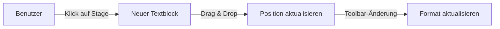
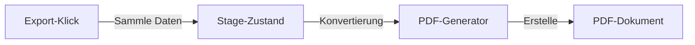

# PrintPDF - Systemdokumentation

## !!! WICHTIGE ANWEISUNGEN FÜR KI-ASSISTENTEN !!!

### KRITISCHE RICHTLINIEN
1. **KEINE LÖSCHUNGEN OHNE EXPLIZITE ANWEISUNG**
   - Jede Komponente und Funktion dieser Anwendung wurde sorgfältig entwickelt
   - Auch wenn bestimmte Elemente redundant oder unnötig erscheinen, sind sie möglicherweise für spezielle Anwendungsfälle erforderlich
   - **NIEMALS** Komponenten, Funktionen oder Dateien entfernen, auch wenn sie scheinbar ungenutzt sind
   - Bei Unsicherheit IMMER nachfragen, bevor Änderungen vorgenommen werden

2. **ERHALTUNG DER FUNKTIONALITÄT**
   - Alle existierenden Features müssen erhalten bleiben
   - Änderungen dürfen nur ERGÄNZEND sein, nicht ERSETZEND
   - Bei Verbesserungsvorschlägen: Neue Funktionen hinzufügen, alte nicht entfernen

3. **VERPFLICHTENDE KONSULTATION**
   - Vor jeder strukturellen Änderung muss der Benutzer konsultiert werden
   - Dokumentation von Abhängigkeiten vor Änderungen erforderlich
   - Detaillierte Erklärung der Auswirkungen jeder Änderung

### GESCHÜTZTE KOMPONENTEN UND FUNKTIONEN
Folgende Elemente sind KRITISCH und dürfen nicht ohne explizite Genehmigung geändert werden:
- Alle PDF-Generierungsfunktionen
- Stage-Komponente und deren Logik
- Textblock-Verwaltung und -Positionierung
- Schriftarten-Handling und -Mapping
- Toolbar-Funktionalitäten
- Konfigurationsdateien

## Überblick
PrintPDF ist eine Next.js-basierte Webanwendung zur Erstellung von PDF-Dokumenten mit präziser Textplatzierung. Die Anwendung ermöglicht es Benutzern, Text auf verschiedenen Papierformaten zu platzieren und als PDF zu exportieren.

## Technologie-Stack
- **Frontend Framework**: Next.js 13+ mit App Router
- **Styling**: Tailwind CSS
- **PDF-Generierung**: jsPDF
- **UI-Komponenten**: shadcn/ui
- **Schriftarten**: Lokale Schriftarten-Integration

## Kernkomponenten

### 1. Stage (`/src/components/Stage.tsx`)
- **Hauptfunktion**: Visueller Editor für die Textplatzierung
- **Wichtige Features**:
  - Drag & Drop Textblöcke
  - Live-Vorschau der Textformatierung
  - Maßstabsgetreue Darstellung verschiedener Papierformate
- **Zustandsmanagement**:
  - Verwaltet Position und Eigenschaften aller Textblöcke
  - Koordiniert die Auswahl und Bearbeitung von Textblöcken

### 2. PDF-Generator (`/src/lib/pdf-generator.ts`)
- **Hauptfunktion**: Konvertierung der Stage-Inhalte in PDF
- **Wichtige Features**:
  - Präzise Textpositionierung
  - Schriftarten-Mapping für PDF-Kompatibilität
  - Beschnittmarken-Unterstützung
- **Konfiguration**: 
  - Einstellungen in `/src/config/settings.ts`
  - Anpassbare Skalierungsfaktoren für Schriftgrößen
  - Konfigurierbare Ränder und Beschnitt

### 3. Toolbar (`/src/components/Toolbar.tsx`)
- **Hauptfunktion**: Benutzersteuerung für Textformatierung
- **Features**:
  - Schriftart-Auswahl
  - Größenanpassung
  - Gewicht- und Stil-Kontrollen
  - PDF-Export-Funktion

### 4. Konfiguration (`/src/config/settings.ts`)
- **Hauptfunktion**: Zentrale Verwaltung aller Systemeinstellungen
- **Bereiche**:
  - PDF-Einstellungen (Skalierung, Beschnitt)
  - Stage-Einstellungen (Standardwerte)
  - Toolbar-Einstellungen (Grenzwerte)

## Datenstrukturen

### TextBlock
```typescript
interface TextBlock {
  id: string
  text: string
  x: number      // Position in %
  y: number      // Position in %
  fontSize: number
  fontFamily: string
  fontWeight: number
  color: string
}
```

### PaperSize
```typescript
interface PaperSize {
  id: string
  name: string
  width: number  // in mm
  height: number // in mm
}
```

## Datenfluss

1. **Benutzerinteraktion** → **Stage**
   - Benutzer platziert/bearbeitet Text auf der Stage
   - Stage aktualisiert interne Zustandsverwaltung

2. **Stage** → **Toolbar**
   - Toolbar zeigt aktuelle Textblock-Eigenschaften
   - Änderungen werden zurück an Stage propagiert

3. **Stage** → **PDF-Generator**
   - Bei Export werden alle Textblock-Daten übergeben
   - Generator erstellt PDF mit korrekter Skalierung

## Wichtige Prozesse

### 1. Text-Platzierung


### 2. PDF-Export


## Konfigurationsoptionen

### PDF-Einstellungen
- `fontScaleFactor`: Skalierung der Schriftgrößen (Standard: 2.5)
- `bleed`: Beschnitt in mm (Standard: 3)
- `minMargin`: Minimaler Randabstand (Standard: 10)

### Stage-Einstellungen
- `defaultWidth`: Standard-Breite des Stage-Bereichs
- `layerPanelHeight`: Höhe des Layer-Panels
- `defaultTextBlock`: Standard-Textblock-Eigenschaften

## Fehlerbehandlung

1. **PDF-Generierung**
   - Validierung der Textblock-Positionen
   - Fallback-Schriftarten bei Nicht-Verfügbarkeit
   - Fehlerprotokollierung bei Export-Problemen

2. **Stage-Interaktion**
   - Begrenzung der Textblock-Bewegung
   - Validierung der Eingabewerte
   - Automatische Korrektur ungültiger Zustände

## Erweiterungspunkte

1. **Neue Funktionen**
   - Mehrere Seiten unterstützen
   - Zusätzliche Texteffekte
   - Bildimport-Funktion

2. **Optimierungen**
   - Schriftarten-Caching verbessern
   - Performance-Optimierung bei vielen Textblöcken
   - Erweiterte PDF-Exportoptionen

## Bekannte Einschränkungen

1. **PDF-Export**
   - Begrenzte Schriftarten-Unterstützung
   - Keine komplexen Texteffekte
   - Feste Seitenausrichtung

2. **Benutzerinterface**
   - Keine Mehrfachauswahl von Textblöcken
   - Begrenzte Undo/Redo-Funktionalität

## Wartung und Updates

### Schriftarten aktualisieren
1. Neue Schriftart in `/src/data/fonts.ts` hinzufügen
2. Mapping in PDF-Einstellungen aktualisieren
3. Font-Familie in Toolbar-Optionen ergänzen

### Papierformate hinzufügen
1. Format in `/src/data/paper-sizes.json` definieren
2. Stage-Darstellung anpassen
3. PDF-Generator-Logik prüfen

## Entwicklungsrichtlinien

1. **Code-Organisation**
   - Komponenten in logische Ordner gruppieren
   - Wiederverwendbare Logik in Hooks auslagern
   - Typen zentral definieren

2. **Styling**
   - Tailwind-Klassen für Konsistenz nutzen
   - Komponenten-spezifische Styles isolieren
   - Dark/Light Mode berücksichtigen

3. **Testing**
   - Komponenten-Tests für kritische Funktionen
   - PDF-Output-Validierung
   - Benutzerinteraktions-Tests

## Deployment

1. **Voraussetzungen**
   - Node.js 16+
   - npm oder yarn
   - Ausreichend Speicherplatz für Schriftarten

2. **Build-Prozess**
   ```bash
   npm run build
   npm start
   ```

3. **Umgebungsvariablen**
   - Keine sensiblen Daten erforderlich
   - Optionale Debug-Flags verfügbar

## Support und Ressourcen

- **Dokumentation**: `/docs` Verzeichnis
- **Beispiele**: `/examples` Verzeichnis
- **Konfiguration**: `/src/config` Verzeichnis

---

*Diese Dokumentation wird kontinuierlich aktualisiert, um Änderungen und Verbesserungen der Anwendung zu reflektieren.*
